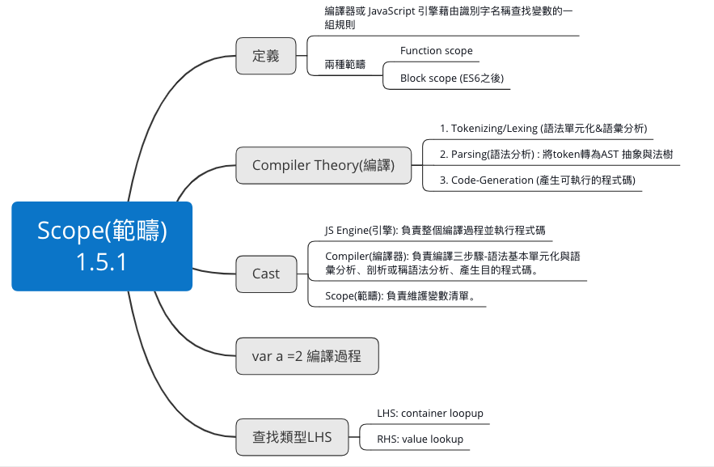
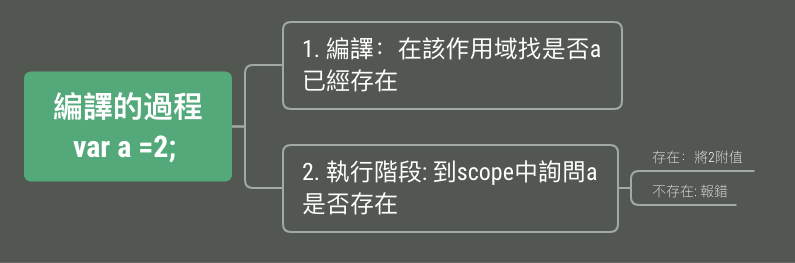

## 1.5.1 What is Scope?

#### Chapter Map
<br>

<h5>

#### Web JS Engine
```
Chrome: V8
Firefox: Spider Monkey
Safari: Nitro Engine
```

#### Code的編譯過程



#### LHS & RHS 如何分辨？ 分辨的目的為何？

LHS: Container lookup
RHS: Value lookup

##### 問題討論: 
```
var b = b;
程式先執行左邊還是右邊? 
如何證明？
```


## 1.5.2 Lexical Scope
```
Lexical Scope為ES6新增的，目的是避免污染其他區域的變數

```
#### var & let 作用域的差別 (var髒髒der)

```javascript
var b = 2;
{
  var a = 1;
}
console.log(a + b);
```

```javascript
let a = 2;
{
  let b = 1;
}
console.log(a + b);
```

```javascript
{
  var a = 123;
  let b = 456
}
console.log(a,b);
```


```javascript
for (var i =0; i<5; i++) {
  console.log('i inside', i);
}
console.log('i outside',i); 
```


#### 當前作用域沒該變數時會向外層尋找
>子可向父要東西，但父不能向子層要東西

```javascript
let father = 2;
{
  let children = 1;
  console.log(father + children);
}
```

##### Lex-time

```javascript
var c = 10
function foo(a) {
  var b = a * 2; 
  function bar (c) {
    console.log(a,b,c);
    console.log('c', c)
  }
  bar( b*3);
  console.log('c',c);
}
foo(2)
```


### function scope 也是scope
### 父層不能向子層要東西的例外？
> 因為scope的緣故或是var? 
``` javascript
  function myFunction() {
    for(var i = 0; i < 5; i++) {
      var insideFor = 'This is inside for';
    }
    console.log(insideFor);		// "This is inside for"
    console.log(i);				// 5
  }

  myFunction();

```


``` javascript
for (var j = 0; j < 5; j++) {
    console.log('j inside for: ',j)
} console.log(j)

```
> 

#### Shadowing 遮蔽外層變數

```javascript
var myGf = 'Outside Gf'

function shadowing() {
  //  var myGf = 'Inside Gf';
  console.log('myGf: ',myGf);			//  "hello scope"
}
shadowing();
// console.log('outside', myGf)

```

#### eval() 脫離Lexical的掌控
> 全域中的function <br>
> 把字串當作變數並在編譯時轉成程式碼 <br>
> 'strict mode' 無法使用
``` javascript
function foo(a, str) {
  eval (str);
  console.log(a,b)
}

var b =2;
foo(1, "var b = 3;")

```

>外層的 b =2 被遮蔽了

## Block Scope let var
```javascript
// let block scope 存在的東西
// block scope 種類=> for (), if(), while(), switch()
// => 外洩、污染問題

for 迴圈可想成是兩個scope

for (let i=0; i<5; i++) {
  //script
}


{
  let i =0
  {
    //script
  }
}


```


### Scope Chain
```javascript
function b() {
  console.log(myVar);
}
function a() {
  var myVar =2;
  b();
}

var myVar =1;
a();

b 在global宣告

```

```javascript
function b() {
  console.log(myVar);
}
function a() {
  var myVar =2;
  b();
}

a();    // Uncaught ReferenceError

```
``` javascript
function a() {
  function b() {
    console.log(myVar);
  }

  var myVar =2;
  b();

}
var myVar =1;
a();

```


<!-- ```
// hoisting

console.log(a);

var a =3;

function a () {

}

``` -->